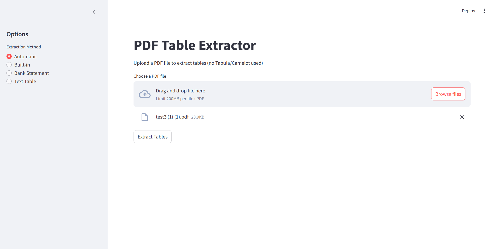
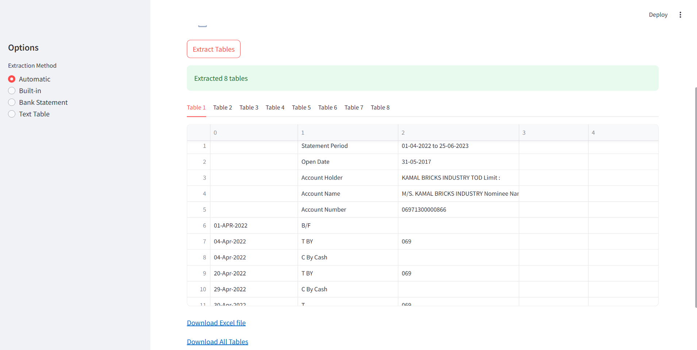

# 📄 PDF Table Extractor App
### Developed by: Manish Kumar sinha 
*(Hackathon Project – Detecting and Extracting Tables from PDFs without Tabula or Camelot)*

---

## 📌 Overview

**PDF Table Extractor** is a Python-based tool and Streamlit web app that intelligently extracts tables from PDF documents and saves them into clean Excel files.  

It does **not rely on Tabula or Camelot** and is capable of handling:
- ✅ Regular tabular formats (with or without borders)
- ✅ Irregular or free-form data alignment
- ✅ Bank statement formats using custom logic

---

## 🚀 Key Features

- 🧠 Automatic multi-method extraction (built-in, pattern-based, custom)
- 🏦 Bank statement recognition using regex + line parsing
- 📃 Text-based table detection from aligned spacing
- 🧼 Table cleanup, column naming, and data structure formatting
- 📥 Export to Excel (multi-sheet if needed)
- 🌐 Web interface via Streamlit for non-technical users

---

## 🛠️ Installation

Install the dependencies using pip:

```bash
pip install pdfplumber PyPDF2 pandas openpyxl streamlit

📂 Folder Structure

📂 PDF-Table-Extractor
│── pdf_extractor.py   # Main script
│── README.md          # Project documentation
│── requirements.txt   # List of dependencies
│── 📂 pdfs            # Folder to store input PDFs
│── 📂 output          # Folder to store extracted Excel files

📸 Example Output




After processing, extracted tables are saved as Excel files in the output/ folder, each sheet containing a table from the PDF.

🤝 Contributing

Feel free to fork this repository and improve the extraction logic. Contributions are welcome!
